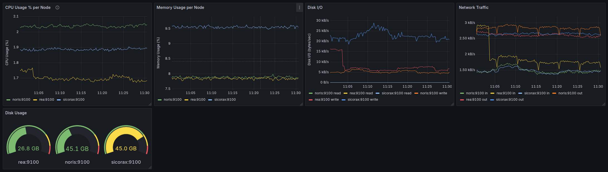

# ICCUB Toy Cluster Monitoring

This project provides a Prometheus + Grafana setup to monitor the ICCUB toy cluster, but it can also be easily adapted for other clusters.

### Dashboard
The dashboard includes:
- **1 gauge panel** displaying disk usage per node
- **4 time series panels**:
  - CPU usage per node
  - Memory usage per node
  - Disk I/O per node
  - Network traffic per node



### What's included:
- Persistent storage for metrics and dashboards via Docker volumes.
- A JSON file _dashboards/dashboard.json_ defining the Grafana dashboard (used only in the first run).
- Prometheus configuration file defining cluster nodes and scrape intervals.

### Prerequisites
- Prometheus [node exporters](https://github.com/prometheus/node_exporter) must be installed on all the nodes in the cluster.
- Docker must be installed on the host where Grafana and Prometheus will be running at.

### How to start monitoring
 1. **Start the stack:**
    ```shell
    docker compose up -d
    ```
2. **Access Grafana:**
    - Open: http://localhost:3000
    - Default login (can be changed on the first run):
      - User: _admin_
      - Password: _admin_
3. **Import the dashboard** from the _dashboard.json_ file. 
4. **Refresh dashboard panels (first run only):** On first run, dashboards will show errors related to incorrect datasource references because the JSON references datasource UIDs that Grafana assigns dynamically. 
Click _Refresh_ on individual panels.

### Notes
- Access Prometheus UI: http://localhost:9090.
- Prometheus data is stored in the Docker volume _prometheus-data_.
- Grafana data (dashboards, datasources) is stored in the Docker volume _grafana-storage_.
